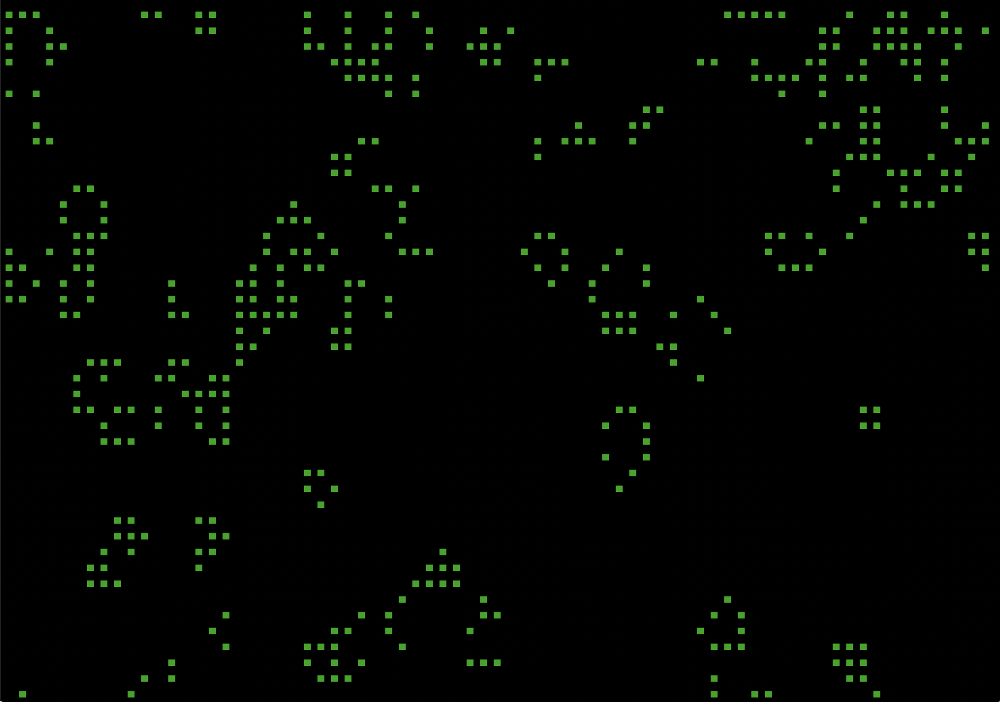

# Conway's Game of Life
Visualizing Conway's Game of Life on the terminal.

## Example
A screenshot of the visualization:

## Requirements
* Python 2.7 or Python 3.5
* Unix-based OS

## Usage
Run the Game of Life visualization with default settings (grid size equals size of the terminal window):

`$ python game.py`

Exit the Game of Life visualization by pressing `Ctrl-C`.

Create a 24 x 40 block grid on your terminal, and run for 1000 ticks with a pause of 0.04 seconds between each tick:

`$ python game.py 24 40 1000 0.04`

## TODO
1. Restart if caught in a repetitive cycle
2. Optimize performance
3. Use 255 colors
4. Allow user to specify which colors to use
5. Allow other ways to exit the program
