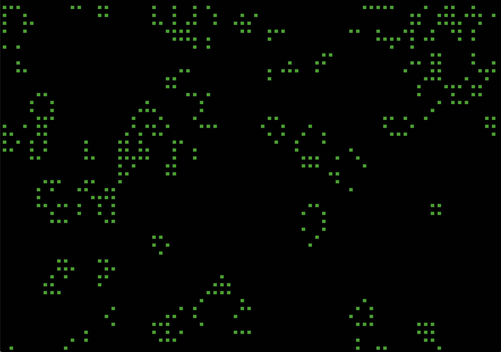

# Conway's Game of Life
Visualizing Conway's Game of Life on the terminal.

## Example
A screenshot of the visualization:

## Requirements
* Python 2.7 or Python 3.5
* Unix-based OS (for ncurses support)

## Usage
Run the Game of Life visualization with default settings (grid size equals size of the terminal window):

`$ python game.py`

Create a 24 x 40 block grid on your terminal, and run for 1000 ticks with a pause of 0.04 seconds between each tick:

`$ python game.py 24 40 1000 0.04`

Create a 24 x 40 block grid with red live cells on a black background:

`$ python game.py 24 40 1000 0.04 red black`

Supported colors: `black`, `blue`, `cyan`, `green`, `magenta`, `red`, `white`, `yellow`

Exit the Game of Life visualization by pressing `Ctrl-C`, `q`, `Q`, or `Esc`.

## Tests
Run the automated test suite with:

`$ python3 -m unittest discover -s tests -p 'test*.py'`

## TODO
1. Restart if caught in a repetitive cycle
2. Optimize performance
3. Use 255 colors
